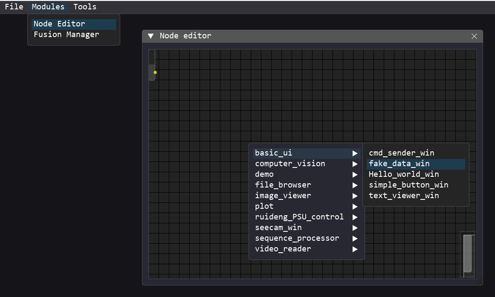
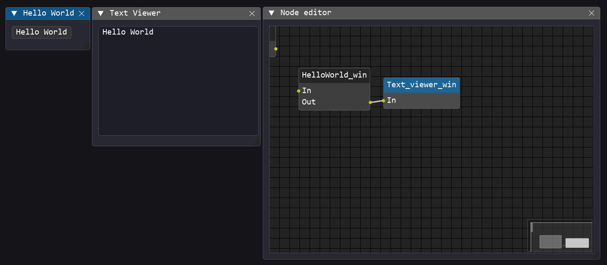
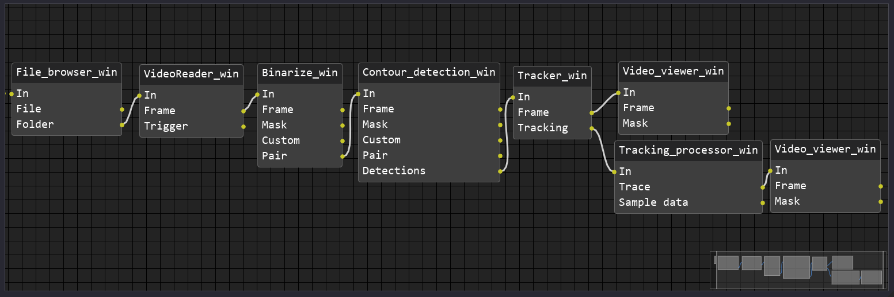
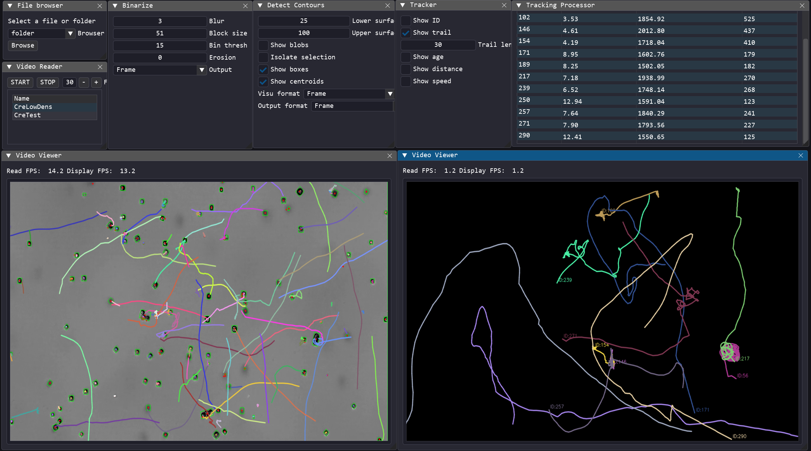
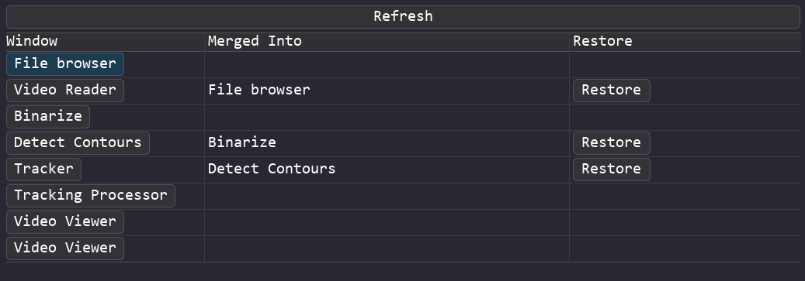
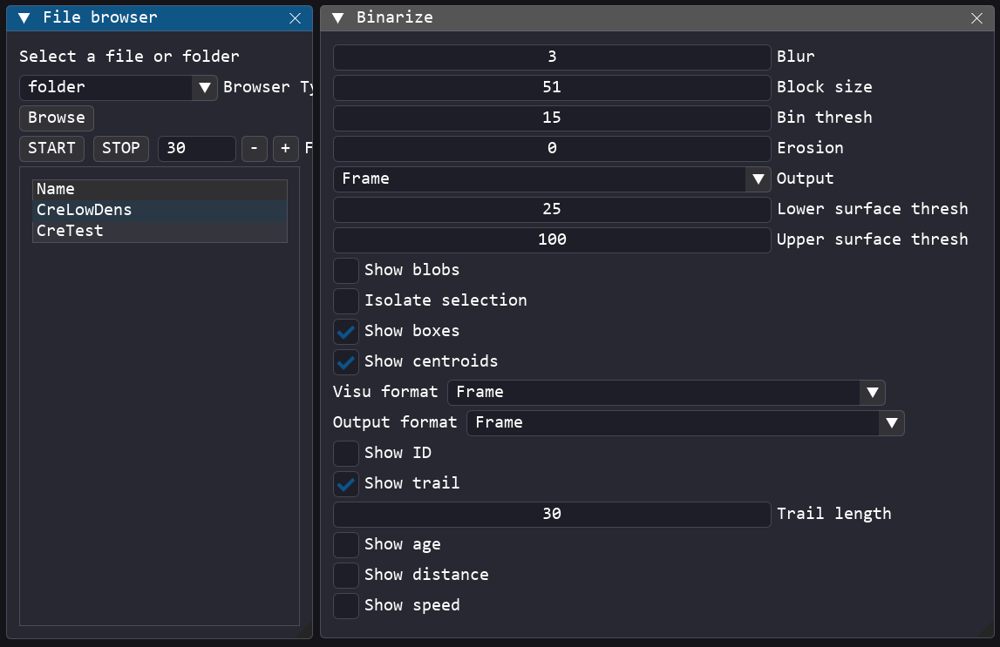

# Node Assistant
A low-code/no-code toolbox to create Python apps and GUIs 

## 🎯 What is the purpose of this project?

**Node Assistant** aims to simplify the creation of Python applications and user interfaces by providing a low-code/no-code environment.  
It is designed to help developers, scientists, makers, and hobbyists build functional GUIs and logic-based tools without writing complex boilerplate code.

At its core, Node Assistant is powered by  [**DearPyGui**](https://github.com/hoffstadt/DearPyGui), and provides a simplified way to create **modules** (standardised functional code blocks) and define how they interact.

You can choose between two approaches:

- **No-code**: use a visual node editor to add modules and connect them together to build the logic and interface of your app without writing a single line of code.
- **Low-code**: speed up development by automating repetitive tasks, while still allowing full control when needed.

Of course, this system is not a replacement for fully custom code. A hand-written application will always offer more flexibility, optimization, and control.  

**Node Assistant** is ideal for rapid prototyping, quick tool creation, and making GUI development more accessible, especially for beginners.

## 🧬 For a bit of context
This project was born out of a research need.

As part of my PhD in biology, I study the motility and photosynthesis of microalgae. This led me to develop various software tools to control measurement devices, automate culture systems, process data, and analyze images and videos.

As the number of separate programs kept growing, managing them individually became inefficient. **Node Assistant** was created to unify all these tools under one framework. Instead of maintaining each project independently, I can now handle everything from a single interface. Each individual application becomes just a different layout or flow deployed in Node Assistant.

Because of its origins, most of the current (and upcoming) modules are focused on scientific applications such as image analysis, plotting, and hardware automation.  
However, I’m also working on more general-purpose modules that can be useful to a broader audience.

Node Assistant was designed with **modularity**, **standardization**, and **future-proofing** in mind.  
It was built so the community can easily develop and add new modules. 

So if the module you need doesn't exist yet: **build it !** It’s easier than you think 😉

## ⚙️ Features

- **Node-based editor**  
  Create complete applications using a visual nodal interface with no code required.

- **Simplified scripting system**  
  Build logic and interfaces in just a few lines of code using a minimal, structured approach.

- **DearPyGui boilerplate management**  
  Automatically takes care of window setup, callbacks, and layout handling to reduce repetitive code.

- **Extended window management**  
  Adds functionality to combine multiple windows into a single layout (not natively supported by DearPyGui).

- **Optional multiprocessing**  
  Modules can run either in the main thread or in separate processes, allowing asynchronous execution to improve performance and responsiveness when needed.

- **Flow import/export**  
  Save and load application logic as JSON files to share, duplicate, or version workflows.

## 📦 Dependencies

### Minimal (to run Node assistant)
- DearPyGUI
- Loguru

### Advanced (to run the modules)
- OpenCV
- Numpy
- PySerial
- PyMODBUS
- natsort
- pandas
- pillow

## 🚀 How to use

This section explains how to use the key tools available in Node Assistant.

---

### Node Editor

Start by launching the program.  
Then go to the top menu:  
**Modules → Node editor**

A new window will appear containing the node editor.

You may notice an empty node floating in the canvas, don't worry about it 😄  
It’s used as a workaround to get a reference point at coordinate `(0, 0)`.  
This is required to support relative positioning in the canvas.

Right-click anywhere in the canvas to bring up the popup menu.  
It will list all available modules. These are automatically detected based on the folder structure in `/modules`.

> The category/subfolder structure in `/modules` is reflected in the popup menu.

<p align="center">
  
</p>

Let’s build a minimal example to understand how modules interact.

Right-click in the canvas and add:
   - A Hello world module
   - A text viewer module

Now, connect the **output** of the button module to the **input** of the text viewer.

✅ Since both modules use the same `IOTypes.TEXT`, the connection will succeed.

if you click on the button in its window → `"Hello World"` will appear in the text viewer.

<p align="center">
  
</p>

> That’s it ! You’ve just built your first working flow!

--- 

Now that you've seen the basics, let’s try a slightly more advanced flow.  
The following flow sets up a **video analysis pipeline** for tracking microalgae:

<p align="center">
  
</p>

The internal code logic of each module isn't important for this demo, the goal is to show how easily a complete analysis chain can be built using individual building blocks.

Each module automatically opens its own DearPyGui window, allowing you to control the parameters of the corresponding algorithm:

<p align="center">
  
</p>


This is great, but…  
When your flow starts growing, you end up with a lot of floating windows.
Even if modules like **Binarize**, **Detect contours**, and **Tracker** are separate components, they are often used together in the same pipeline.  
Wouldn't it be nice to control all parameters from **a single window**?

✅ That's exactly what the **Fusion Manager** is for!

###  🔥 Fusion manager

The Fusion Manager allows you to **visually merge multiple module windows** into a single DearPyGui window , while keeping their internal logic completely separated.  
This improves readability and helps you design cleaner user interfaces.

To try it:

1. Open **Modules → Fusion manager**
2. Click **Refresh** to list the current modules
3. Drag and drop one module onto another → they will be merged

<p align="center">
  
</p>

You can perform **multiple fusions** in a row:  
`A + B → AB`, then `AB + C → ABC`

And of course, you can **restore** any window to its original, standalone state.

<p align="center">
  
</p>


### 💾 Saving & Restoring your workspace

Once you're happy with a flow, you can **save its complete state** for future use.

Go to:  
**File → Save workspace**

This will export everything into a JSON file named:

```
layouts/manual_layout.json
```

To restore that layout on next launch, simply call this in `main.py`:

```python
load_workspace('layouts/manual_layout.json')
```

---

What gets saved:

- All loaded modules
- Window positions and sizes
- Persistent variables (those listed in `self._persistent_fields`)
- Node connections in the editor
- Fusion Manager states (merged windows are preserved)

✅ This means your app will look and behave **almost exactly** as it did when you saved it.


## 📝Create flow programmatically 

Not everyone loves No-code.  
Clicking, dragging, connecting...that can feel tedious when you already know exactly what you want to build.

Node Assistant lets you define your entire flow **programmatically**:
- Load and position modules
- Set parameters
- Create or remove connections
- Merge windows


By default, you can describe your manual layout in:

```
core/manual_layout.py
```

Then, in `main.py`, call:

```python
manual_layout.create_windows()
```

---

### 🧪 Example: Hello World (programmatic version)

This is equivalent to the drag-and-drop version, but written in code:

```python
from modules.demo.hello_world.hello_world_win import HelloWorld_win
from modules.generic.text_viewer.text_viewer_win import Text_viewer_win

def create_windows():
    helloworld = HelloWorld_win(label="Hello World", pos=(50, 50), win_width=300, win_height=200)
    text_viewer = Text_viewer_win(label="Text Viewer", pos=(350, 50), win_width=400, win_height=300)

    helloworld.connect_to(text_viewer, 0)
```

---

### 🎥 Example: Video processing with merged interface

You can also create more advanced flows and merge windows together, like in the computer vision demo :

```python
from modules.computer_vision.binarize.binarise_win import Binarize_win
from modules.computer_vision.contour_detection.contour_detection_win import Contour_detection_win
from modules.computer_vision.tracker.tracker_win import Tracker_win

def create_windows():
    binarise = Binarize_win(label="Binarize", pos=(50, 50), win_width=300, win_height=200)
    contour_detection = Contour_detection_win(label="Contour Detection", pos=(50, 50), win_width=400, win_height=300)
    tracker = Tracker_win(label="Object Tracker", pos=(50, 50), win_width=400, win_height=300)

    binarise.connect_to(contour_detection, 3)
    contour_detection.connect_to(tracker, "Detections")

    tracker.merge_into(contour_detection)
    contour_detection.merge_into(binarise)
```
> This approach is ideal for scripted workflows, reproducible demos, or to automate creation of new GUI element on a specific trigger

The `.connect_to()` method can accept **either**:

- an **index** of the output  
  (e.g., `0` to use the first declared output)
- or a **string key** matching the name in `self.outputs`  
  (e.g., `"TEXT"` or `"Mask"`)

--- 

Even if a flow is created programmatically, it can still be edited using the visual Node Editor.

You just need to call :

```python
node_editor.rebuild_from_instances(MODULES_REGISTRY)
```

This will reconstruct a visual flow from the current program state, including all active modules and their connections.

You can then modify it manually and export it to JSON like any other layout.
## 🔧 To go further

This project is **not a standalone GUI library**, but rather a **plugin/wrapper** built on top of [DearPyGui](https://github.com/hoffstadt/DearPyGui).  
And that’s entirely by design.

Why?

- 🧠 No need to reinvent the wheel, you keep full access to native DearPyGui tools  
- 🧩 Writing new modules stays **simple and flexible**  
- 🔁 You can freely combine Node Assistant features with pure DPG code  
- 🌐 It's **not limited to DearPyGui**, you can integrate other libraries directly into your modules  
- 🔄 The system is **non-invasive**: it doesn't patch or override DPG internals, making it easier to follow future **DearPyGui updates**

---

The following sections will help you **understand how the system works**, and how to **extend it with your own features and modules**.


### 🗂️ Project structure

The Node Assistant project is organized into several folders, each with a specific role:

- **`config/`**  
  Contains the `config.json` file, which defines various default settings and style parameters for the program, including the visual theme for DearPyGui.

- **`core/`**  
  Contains the core code that powers Node Assistant. These files are critical to the system and **should not be modified** when developing new modules.  
  (A detailed explanation of this folder will be provided later in the documentation.)

- **`layout/`**  
  Stores JSON layout files that define your application flows. Layouts are stored here by default for convenience, but you can import/export them from any path.  
  (Clipboard import/export is planned for future releases.)

- **`modules/`**  
  Contains all the functional modules used by the program.  
  Each module is placed in its own subfolder and **must be self-contained**, including all its dependencies and companion scripts.  
  While sharing code between modules is technically possible, it's **not recommended**, users may add or remove modules independently, and shared dependencies can lead to compatibility issues.

- **`resources/`**  
  Holds additional assets such as fonts, icons, and other graphical elements.

- **`template_and_doc/`**  
  Provides example scripts and templates to help you create your own modules quickly and consistently.

- **`test_files/`**  
  Contains data files used for testing and validating certain modules.  
  While test data can also be included within each module’s folder, this common folder makes it easier to access test files directly from Node Assistant’s file browser.

- **`tools/`**  
  Contains utility scripts that may be reused by multiple modules, in order to reduce code duplication.

## 🧠 Core system

The core of Node Assistant handles how modules are loaded, connected, executed, and how data flows between them at runtime.  
To ensure stability and consistency, several mechanisms have been implemented at the system level.

Below are the key elements of the core system.

---
### 🗔 Main Window

When the program starts, Node Assistant attaches a primary window to the DearPyGui viewport.

This main window includes:
- a basic menu bar with native DearPyGui debugging tools
- access to the node editor
- access to the fusion manager
- an option to export the current layout

You can customize this main window to add additional menus or tools.  
**Be careful**: this window is shared across all instances of the program and is **independent** from any layout or module defined in the JSON flow.

Modifying it affects the global interface, not the content of individual flows or modules.  
Use this space for general-purpose or global tools only.


### 🔌 Input/Output types

Since Node Assistant dynamically loads and connects modules during runtime, it's essential to ensure that connections between modules are valid.

To keep the system stable and avoid incompatible connections, each module explicitly declares : 

- **input types** : the types of data it can receive
- **output types** : the types of data it can produce

These types are defined in a central enumeration called `IOTypes`.  
Each type entry includes:
- a unique name (used for matching between nodes)
- the expected Python data structure
- a short description of what the type represents

This mechanism allows Node Assistant to check compatibility between connected modules:
- In the **node editor**, invalid connections (e.g., linking a NumPy frame to a text viewer) are automatically blocked.
- In the **low-code scripting system**, calling `moduleA.connect_to(moduleB)` will return `False` if the types are not compatible.

Below is a list of some available types:

| Type name          | Expected data     | Description                                                               |
|--------------------|-------------------|---------------------------------------------------------------------------|
| `TRIGGER`          | `str` or `None`   | Trigger signal without attached data                                      |
| `FILE_PATH`        | `str`             | Path to a file (e.g. image, video)                                        |
| `FOLDER_PATH`      | `str`             | Path to a directory                                                       |
| `FRAME`            | `np.ndarray`      | Image frame (typically a NumPy array)                                     |
| `CMD_DICT`         | `dict`            | Dictionary representing a command                                         |
| `CMD_LIST`         | `list`            | List of commands                                                          |
| ... | ... | ... | 

> Developers are free to define new types if needed. Just make sure both connected modules use the same name for compatibility.

### 🧱 WindowBase and ProcessingBase

Most modules only require a small amount of user-defined code.  
The rest relies on a minimal set of standardized base classes that handle common behavior and ensure consistency across modules.

These base classes are:

- **`WindowBase`**  
  Provides the foundation for creating a standard DearPyGui window.  
  It handles window creation, layout integration, registration in the flow system, and connection logic (inputs/outputs).

- **`ProcessingBase`**  
  Designed for modules that run asynchronously in a separate process.  
  It manages the creation and destruction of the process, and handles data exchange between the main application and the worker process using `multiprocessing.Queue`.

All modules that need a UI or asynchronous processing inherit from one of these base classes.  
By relying on them, you avoid boilerplate code and ensure compatibility with the flow editor and runtime system.

> ⚠️ Modifying these base classes will affect **all modules** that depend on them. Only advanced users should do so, and with caution.


### 🧩 how to create your own module

Each module in Node Assistant is self-contained and typically built around a Python class that inherits from `WindowBase`.

Below is a basic example of a module called `Template_win` that you can copy and modify.  

```python
import dearpygui.dearpygui as dpg
from core.window_base import WindowBase
from core.input_ouput_types import IOTypes

class Template_win(WindowBase):
	def __init__(self,
				label="Template",
				win_width=300,
				win_height=200,
				pos=(10, 10),
				uuid=None,
				outputs=None,
				visible=True,
				default_number=10): 
		super().__init__(label=label, pos=pos, win_width=win_width, win_height=win_height, uuid=uuid, outputs=outputs, visible=visible)

		self._persistent_fields = ["label","default_number"]
		self.accepted_input_types = [IOTypes.TEXT]
		self.outputs = {
			"TEXT": IOTypes.TEXT,
			"NUMBER": IOTypes.NUMBER
		}
		self.connections = {k: [] for k in self.outputs}

		self.text_tag = f"template_text_{self.UUID}"
		self.number_tag = f"template_number_{self.UUID}"

		self.default_number = default_number

		with dpg.window(label=self.label,
						width=self.win_width,
						height=self.win_height,
						pos=self.pos,
						tag=self.winID,
						show=self.visible):

			dpg.add_button(label="Hello world", callback=self.trigger_cb)
			dpg.add_input_int(tag=self.number_tag,default_value=self.default_number, callback=lambda sender, value: setattr(self, "default_number", value))

	def input_cb(self, *args, **kwargs):
		print(f"{self.winID} received input: args={args}, kwargs={kwargs}")

	def trigger_cb(self, *args, **kwargs):
		for idx, output_key in enumerate(self.outputs):
			connected_modules = self.connections.get(output_key, [])
			for module in connected_modules:
				if idx == 0:
					module.input_cb("Hello World")
				if idx == 1:
					module.input_cb(self.default_number)

EXPORTED_CLASS = Template_win
```

At the end of every module file, you must define:

```python
EXPORTED_CLASS = YourModuleClass
```
This variable is **mandatory**. It tells Node Assistant which class to load when the module is imported.

The module registry system uses `EXPORTED_CLASS` to:
- detect and list available modules automatically
- display them in the Node Editor
- allow dynamic instantiation at runtime via `get_available_modules()`

If this variable is missing or incorrectly defined, your module **won’t be detected** and **won’t appear** in the UI.

### How it works

Each instance of this module creates a **new DearPyGui window**, using a unique UUID to avoid ID conflicts and **multiple instances can coexist** independently. Each manages its own connections via `self.connections`.

On creation, you can configure:
  - `label`: window title
  - `win_width`, `win_height`: window size
  - `pos`: position in the viewport
  - `visible`: whether the window starts visible
  - `custom` : custom parameters

--- 

```python
self._persistent_fields = ["label", "default_number"]
```

This line defines which internal variables should be **saved when the layout is exported**.  
In this case, if the user changes the input value from `10` to `15`, the internal variable `self.default_number` is updated, and this value is preserved in the layout file.

Example of the resulting export:

```json
{
    "windows": [
        {
            "module": "serial.module_template",
            "class_name": "Template_win",
            "uuid": "122",
            "pos": [100, 100],
            "size": [300, 200],
            "visible": true,
            "params": {
                "label": "Template",
                "default_number": 15
            }
        }
    ],
    "connections": []
}
```

When this layout is imported again, `default_number` will be restored to `15` rather than the initial default `10`.


This mechanism allows modules to store user-configurable values (like thresholds, file paths, labels, etc.).

> ✅ Use `_persistent_fields` to define what makes your module's state meaningful across sessions.

---

```python
self.accepted_input_types = [IOTypes.TEXT]
self.outputs = {
    "TEXT": IOTypes.TEXT,
    "NUMBER": IOTypes.NUMBER
}
```

This section defines the **types of data the module can receive and emit**.

- `self.accepted_input_types` is a list of accepted input types, using `IOTypes`.  
- `self.outputs` is a dictionary where each key becomes a **named output** in the Node Editor. The value must be a single `IOTypes` entry (only one type per output).

These type declarations are **required** for connection checking and compatibility between modules.  
If the `IOTypes` entry you need does not exist yet, you must add it to the central type registry in `core/input_ouput_types.py`.

---


```python
self.text_tag = f"template_text_{self.UUID}"
self.number_tag = f"template_number_{self.UUID}"

self.default_number = default_number
```

You can define **custom variables** to support your module’s logic or interface.  
For example, `default_number` is used to store the state of a numeric input.

To simplify debugging and item tracking in DearPyGui’s item registry, it is recommended to **manually define a unique tag** for each UI element (e.g. buttons, inputs, text fields).  
This avoids relying on DPG’s autogenerated internal IDs.

> ⚠️ Always include `self.UUID` in your tag strings to ensure **uniqueness**.  
Two UI items **cannot** share the same tag, even across different modules.

---
```python
with dpg.window(label=self.label,
                width=self.win_width,
                height=self.win_height,
                pos=self.pos,
                tag=self.winID,
                show=self.visible):

    dpg.add_button(label="Hello world", callback=self.trigger_cb)
    dpg.add_input_int(tag=self.number_tag,
                      default_value=self.default_number,
                      callback=lambda sender, value: setattr(self, "default_number", value))
```

This block defines the layout of the module’s user interface using **DearPyGui**.  
Here, a button and an integer input are added inside a window created by `dpg.window`.

> For more advanced UI features, refer to the [DearPyGui documentation](https://github.com/hoffstadt/DearPyGui).

**Note:** A module does **not** need to create a DearPyGui window to function.

Modules without a window (e.g. background processors or invisible controllers) will still be **fully visible and usable** inside the Node Editor.  
They just won’t display anything in the DearPyGui viewport.

---

```python
def input_cb(self, *args, **kwargs):
    print(f"{self.winID} received input: args={args}, kwargs={kwargs}")
```

The `input_cb()` method is called **automatically** when another module (connected upstream) sends data to this one.

This is where you implement the **core logic** of your module , for example:
- extracting values from `args` or `kwargs`
- updating internal state
- triggering new outputs or refreshing the UI

Each call to `input_cb()` corresponds to an event coming from a connected output of another module.

---

```python
def trigger_cb(self, *args, **kwargs):
    for idx, output_key in enumerate(self.outputs):
        connected_modules = self.connections.get(output_key, [])
        for module in connected_modules:
            if idx == 0:
                module.input_cb("Hello World")
            if idx == 1:
                module.input_cb(self.default_number)
```

When this function is triggered (e.g. by a button), the module loops through its outputs.

- `idx` corresponds to the output index  
  In this example: `0` → `"TEXT"`, `1` → `"NUMBER"`
- `connected_modules` is the list of modules connected to that output

For each connected module, `input_cb()` is called and data is sent.

In this case:
- The `"TEXT"` output sends `"Hello World"`
- The `"NUMBER"` output sends the current value of `self.default_number`

> This is how modules communicate and send data to each other in Node Assistant.

### 🧩 How to create your own multiprocessing module

Multiprocessing modules in Node Assistant follow the same general structure as regular modules based on `WindowBase`, but with one key difference: they integrate a **processor** object that inherits from `ProcessingBase`.

This processor runs in a separate subprocess and exposes useful methods:

- `start()` / `stop()` – starts or stops the background process  
- `submit(data)` – sends data to the process via a queue  
- `is_ready()` – tells if the process is ready to receive data  
- `get()` – retrieves the latest result (if available)  
- `update_params(...)` – updates processing parameters live

---

#### 🧪 Example use case: adaptive thresholding

Let’s say you want to build a module that applies **adaptive binarization** to images using OpenCV.  
Since this can be a heavy operation, it makes sense to run it asynchronously in a subprocess, without blocking the main UI.

We want the module to:
- receive image frames (`IOTypes.FRAME`) as input
- return the original frame and the computed binary mask
- allow real-time updates to the processing parameters (`block_size`, `bin_thresh`)

---
Here is the module code:

```python
import dearpygui.dearpygui as dpg
from core.window_base import WindowBase
from core.input_ouput_types import IOTypes
import numpy as np
import threading
from modules.demo.binarise_frame import Binarize_Frame

class Binarize_demo_win(WindowBase):
    def __init__(self, label="Binarize", win_width=300, win_height=200, pos=(10, 10), uuid=None, outputs=None, visible=True):
        if outputs is None:
            outputs = []

        super().__init__(label=label, pos=pos, win_width=win_width, win_height=win_height, uuid=uuid, outputs=outputs, visible=visible)

        self._persistent_fields = ["label"]
        self.accepted_input_types = [IOTypes.FRAME]
        self.outputs = {
            "Frame": IOTypes.FRAME,
            "Mask": IOTypes.MASK
        }
        self.connections = {k: [] for k in self.outputs}

        self.processor = Binarize_Frame(
            params={
                "block_size": 25,
                "bin_thresh": 15
            },
            buffer_size=1,
            drop_policy="drop_new"
        )
        self.processor.start()

        self.block_size_tag = f"binarize_block_size_{self.UUID}"
        self.bin_thresh_tag = f"binarize_bin_thresh_{self.UUID}"

        self._monitor_thread = threading.Thread(target=self._monitor_loop, daemon=True)
        self._monitor_thread_running = True
        self._monitor_thread.start()

        with dpg.window(label=self.label, width=self.win_width, height=self.win_height,
                        pos=self.pos, tag=self.winID, show=self.visible):

            dpg.add_drag_int(label="Block size", default_value=25, min_value=3, max_value=51,
                             callback=self._update_param_cb, tag=self.block_size_tag)
            dpg.add_drag_int(label="Bin thresh", default_value=15, min_value=0, max_value=50,
                             callback=self._update_param_cb, tag=self.bin_thresh_tag)

    def _update_param_cb(self, sender, app_data):
        block_size = dpg.get_value(self.block_size_tag)
        if block_size % 2 == 0:
            block_size += 1
            dpg.set_value(self.block_size_tag, block_size)

        params = {
            "block_size": dpg.get_value(self.block_size_tag),
            "bin_thresh": dpg.get_value(self.bin_thresh_tag),
        }
        self.processor.update_params(**params)

    def on_close(self):
        self._monitor_thread_running = False
        if self._monitor_thread.is_alive():
            self._monitor_thread.join()
        self.processor.stop()

    def is_ready(self):
        return self.processor.is_ready()

    def input_cb(self, *args, **kwargs):
        frame = kwargs.get("data") if "data" in kwargs else (args[0] if args else None)
        if frame is None or not isinstance(frame, np.ndarray):
            return False
        return self.processor.submit(frame)

    def _monitor_loop(self):
        while self._monitor_thread_running:
            result = self.processor.get()
            if result is not None:
                for idx, output_key in enumerate(self.outputs):
                    connected_modules = self.connections.get(output_key, [])
                    for module in connected_modules:
                        if idx == 0:
                            module.input_cb(data=result[0], data_type=IOTypes.FRAME)
                        elif idx == 1:
                            module.input_cb(data=result[1], data_type=IOTypes.MASK)

EXPORTED_CLASS = Binarize_demo_win
```

In addition to the `self.processor`, we also launch a **monitor thread** (`_monitor_thread`) that continuously checks for results.

Whenever a new result is ready, it triggers the output to connected modules.  
This is what allows the module to act **asynchronously** and **automatically** forward new data.

---
Here is the processor class used by the module:

```python
import numpy as np
import cv2
from typing import Any, Dict, Optional
from core.processing_base import ProcessingBase

class Binarize_Frame(ProcessingBase):
    def __init__(
        self,
        params: Optional[Dict[str, Any]] = None,
        *,
        buffer_size: int = 10,
        drop_policy: str = 'drop_new',
        daemon: bool = True,
        logger=None
    ) -> None:

        super().__init__(
            params=params,
            buffer_size=buffer_size,
            drop_policy=drop_policy,
            daemon=daemon,
            logger=logger
        )

    def _process_data(self, frame: Any, p: Dict[str, Any]) -> Any:
        return self._binarize_frame(frame, p)

    def _binarize_frame(self, frame: np.ndarray, p: Dict[str, Any]) -> tuple[np.ndarray, np.ndarray]:
        block_size = int(p.get('block_size', 25))
        bin_thresh = int(p.get('bin_thresh', 15))

        if isinstance(frame, np.ndarray) and len(frame.shape) == 3 and frame.shape[2] == 3:
            mask = cv2.cvtColor(frame, cv2.COLOR_BGR2GRAY)
        else:
            mask = frame.copy()

        mask = cv2.adaptiveThreshold(
            mask, 255,
            cv2.ADAPTIVE_THRESH_GAUSSIAN_C,
            cv2.THRESH_BINARY_INV,
            block_size, bin_thresh
        )

        return frame, mask
```

---

- The `processor` runs in a separate process to keep the UI responsive.
- The `input_cb()` simply submits data to the processor.
- The `monitor_thread` continuously checks for new results and triggers downstream modules when ready.
- Parameters can be updated in real-time using `update_params()`.


##### **Buffer size and drop policy**

The `buffer_size` and `drop_policy` parameters define how the processor handles incoming data and how it behaves under load. This is important to adapt to different use cases.

- **Real-time stream (e.g. webcam feed, live display)**  
  In this case, we want to process only the **most recent frame** and skip older ones if needed.  
  Set:
  - `buffer_size = 1`
  - `drop_policy = "drop_new"`

  This way, if the processor is still busy with the previous frame, the new one is ignored. As soon as it's ready, the next submitted frame will be the latest available.

- **Batch processing (e.g. full video file, offline dataset)**  
  Here, we want to process **every single frame** without skipping.  
  Set:
  - `drop_policy = "block"` (waits until there's room in the queue)
  - Increase `buffer_size` to allow accumulating more frames

  The processor will queue incoming frames and process them in order. The sender will be blocked if the queue is full.

> ⚠️ Choosing the right strategy is important depending on whether **responsiveness** or **completeness** is the priority.
